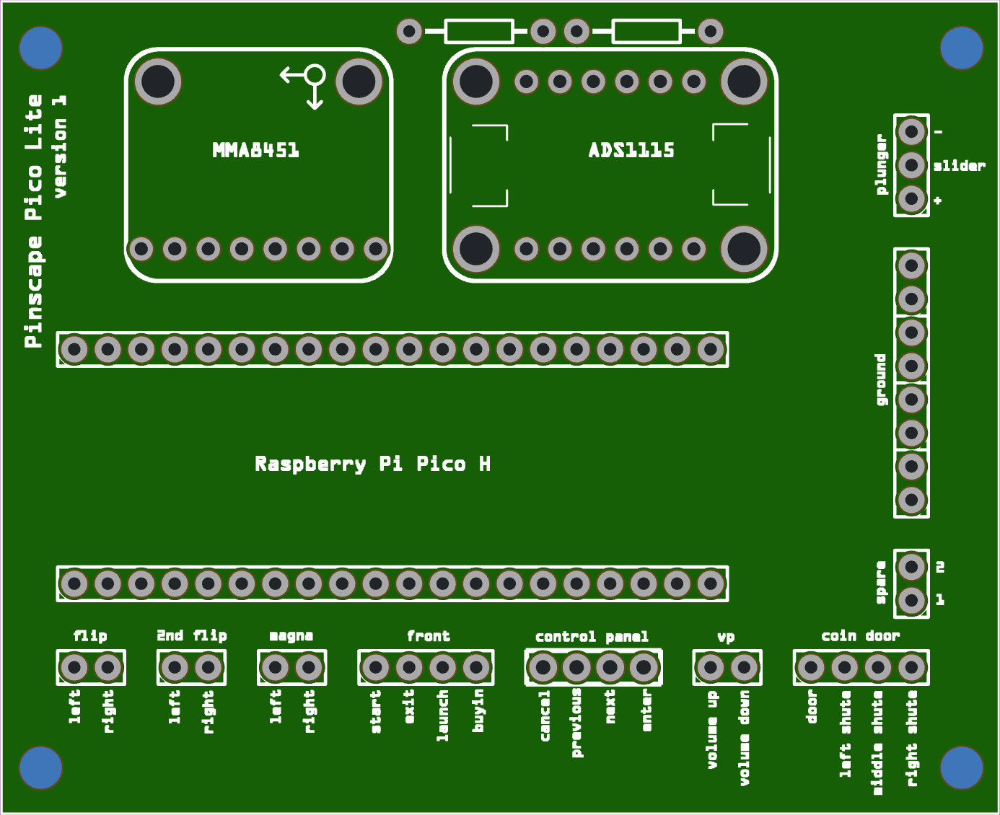
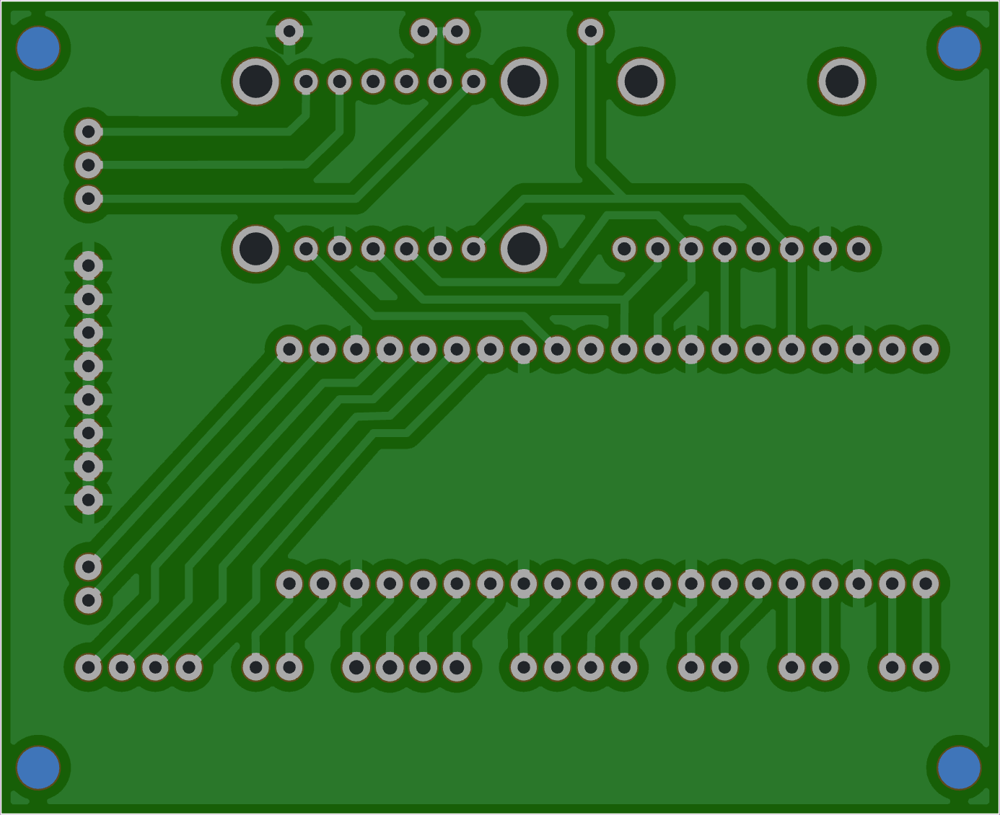
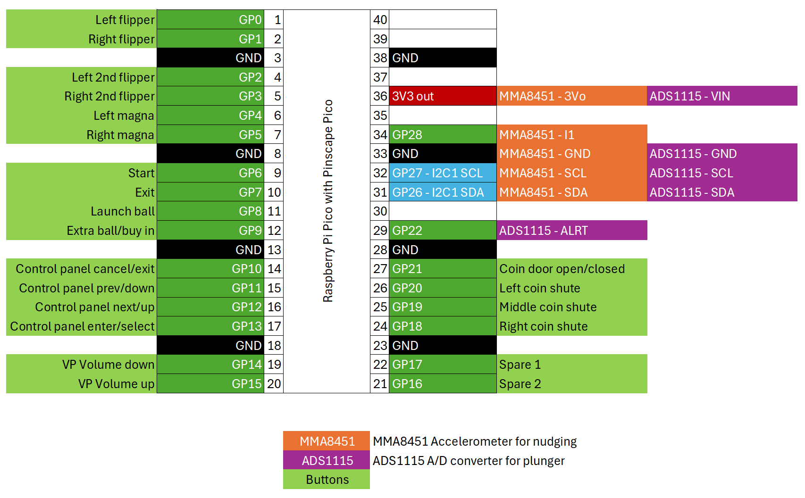

# How-to: "Lite" Virtual Pinball setup with a Pinscape Pico

> Note that this is a work in progress. At this time, the first PCB's have been ordered based on a breadboard prototype. The board should work, but this project comes with NO WARRANTIES.

This page documents how to build a basic board that can be used in a Virtual Pinball cabinet that supports buttons, nudging and a plunger.

The board is based on the great work of Michael J Roberts aka MJR, who developed the [Pinscape Pico](https://github.com/mjrgh/PinscapePico/) I/O controller for pinball cabinets.

This project supports connecting almost all necessary pinball related buttons. It also supports nudging through the Adafruit MMA8451 breakout board and uses the Adafruit ADS1115 breakout board to connect an analog plunger with a potentiometer.

This project is meant as a Virtual Pinball setup without outputs, hence the "Lite". If you need outputs, this project might not be for you. 

## Materials and tools needed

### Materials

- PCB, designed for this project ([Fritzing design](<Pinscape Pico Lite.fzz>))
- Raspberry Pi Pico H ([Raspberry Pi](https://www.raspberrypi.com/documentation/microcontrollers/pico-series.html#pico-1-family), [DigiKey](https://www.digikey.nl/nl/products/detail/raspberry-pi/SC0917/16608257))
- Adafruit MMA8451 Triple-Axis Accelerometer ([Adafruit #2019](https://www.adafruit.com/product/2019), [DigiKey](https://www.digikey.nl/nl/products/detail/adafruit-industries-llc/2019/4990790))
- Adafruit ADS1115 16-Bit ADC ([Adafruit #1085](https://www.adafruit.com/product/1085), [DigiKey](https://www.digikey.nl/nl/products/detail/adafruit-industries-llc/1085/5761229))
- Analog plunger kit ([GermanGamingSupplies](https://germangamingsupplies.com/Analog-Plunger-Set), [Arnoz](https://shop.arnoz.com/en/19-plunger))
- Solder
- 2x 10kΩ resistor
- Misc. pins and connectors (optional)

[Here](parts.csv) is a complete DigiKey parts list (excl. plunger kit)

### Tools

- Soldering station
- Third hand soldering station (preferable)

## Creating the board

The image below shows the layout of the PCB. The PCB is designed in Fritzing and the file can be downloaded here: [Pinscape Pico Lite.fzz](<Pinscape Pico Lite.fzz>) The PCB can be easily ordered at Aisler.net, by uploading the Fritzing file there.

Frontside view (solder components here)

Backside view (for reference only)

### Placing the Raspberry Pi Pico H, MMA8451 and ADS1115
1. Solder the pin headers included in the package to the MMA8451 and the ADS1115
1. Solder the two 10kΩ resistors at the marked location
1. Solder the Raspberry Pi Pico H at the marked location
1. Solder the MMA8451 at the marked location
1. Solder the ADS1115 at the marked location

### Connecting the buttons and plunger
Soldering pin headers to the PCB and using connectors for the button and plunger wires is optional. Alternatively, you can solder the wires for buttons and plunger directly to the board. For the small additional cost, I would advice on purchasing the pins and connectors from the parts list.

### Software configuration

1. Download the [latest Pinscape Pico release](https://github.com/mjrgh/PinscapePico/releases) and unzip it.
1. Start the GUIConfigTool, connect the Pico and install the latest firmware (it's included in the same directory).
1. Copy the text from [config.json](config.json) and paste it in the configuration tab of the GUIConfigTool (replacing the existing text).
1. Click the "Program Pico" button. The Pinscape Pico is rebooted with the new configuration. You can check the Buttons, Nudge and Plunger tabs to see if everything works correctly, tweak the nudge settings and calibrate the plunger.

You now should be all set to use the Pinscape Pico as a Virtual Pinball controller. 

## Background information

Below you will find the button and breakout board connections to the Raspberry Pi Pico / Pinscape Pico. The configuration in the [config.json](config.json) file is based on this layout. If you change something in the layout, the config file should be updated accordingly.
 

## License
Copyright 2025, Marten Schukkink

Released under a [BSD 3-clause license - NO WARRANTY](license.txt)

## Credits and links

- A big shoutout to Michael J Roberts aka MJR for creating the original Pinscape, the [Pinscape Pico](https://github.com/mjrgh/PinscapePico/), the [PinballY frontend](http://mjrnet.org/pinscape/PinballY.php) and [The New Pinscape Build Guide](http://mjrnet.org/pinscape/BuildGuideV2/BuildGuide.php).
- Use and configuration of the MMA8451Q: [[1]](https://github.com/mjrgh/PinscapePico/blob/main/Guides/MMA8451Q-Setup.md) [[2]](http://mjrnet.org/pinscape/PinscapePico/Help/JSONConfigRef.htm#mma8451q)
- Use and configuration of the ADS1115: [[1]](https://github.com/mjrgh/PinscapePico/tree/main/ExpansionBoards/DIY-Friendly#ads1115-adc) [[2]](http://mjrnet.org/pinscape/PinscapePico/Help/JSONConfigRef.htm#ads1115)  [[3]](https://learn.adafruit.com/adafruit-4-channel-adc-breakouts)